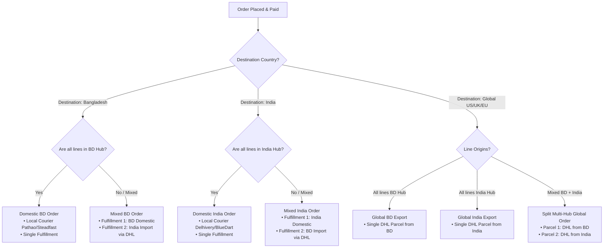

# 04. Order Routing & Multi-Hub Fulfillment

## 1. Order Routing Decision Tree

---

## 2. Split Fulfillment Mechanics

Vendure natively supports **multiple `Fulfillment` records attached to a single `Order`**.

### End-to-End Walkthrough: A Mixed International Order
* **Customer Location**: London, United Kingdom
* **Cart Contents**:
  * 1x *Banarasi Silk Saree* (Stocked in India Hub)
  * 1x *Muslin Summer Dress* (Stocked in Bangladesh Hub)

#### Execution Steps:
1. **Order Authorization**: The customer pays once (via Stripe in USD). A single order record `ORDER-10042` is created.
2. **Fulfillment Splitting**:
   * Vendure's order processor creates **two independent fulfillment tasks**:
     * **Fulfillment 1 (`FULF-01`)**: Assigned to **India Hub** for the *Banarasi Silk Saree*.
     * **Fulfillment 2 (`FULF-02`)**: Assigned to **Bangladesh Hub** for the *Muslin Summer Dress*.
3. **Independent Agent Processing**:
   * The **India Agent** packages the saree, books DHL India, and enters tracking number `DHL-IN-883920`.
   * The **Bangladesh Agent** packages the dress, books DHL Bangladesh, and enters tracking number `DHL-BD-449102`.
4. **Customer Communication**:
   * The customer receives two automated email notifications with distinct tracking links:
     * *"Part of your order has dispatched from our India Atelier (Tracking: DHL-IN-883920)."*
     * *"Part of your order has dispatched from our Dhaka Atelier (Tracking: DHL-BD-449102)."*

---

## 3. Customs & Regulatory Compliance

### 3.1 Indian Customs Import KYC (BD $\to$ India)
* Under Indian Customs regulations, all incoming international couriers require the **recipient's government-approved identity** (Aadhaar, PAN, or Passport number).
* **Implementation**:
  * When shipping country is selected as **India** and the cart includes **Bangladesh Hub items**, the checkout renders a required field:
    * `Recipient KYC Document Type` (Dropdown: Aadhaar, PAN, Passport)
    * `Recipient KYC Number`
  * Stored in `Order.customFields.recipientKycId` and printed on the DHL Commercial Invoice.

### 3.2 Harmonized System (HS) Codes
Every international package automatically prints a commercial invoice with standard garment HS codes:
* **Silk Garments**: HS `6204.49` / `6206.10`
* **Cotton & Muslin Garments**: HS `6204.42` / `6206.30`
* **Denim Apparel**: HS `6203.42` / `6204.62`
