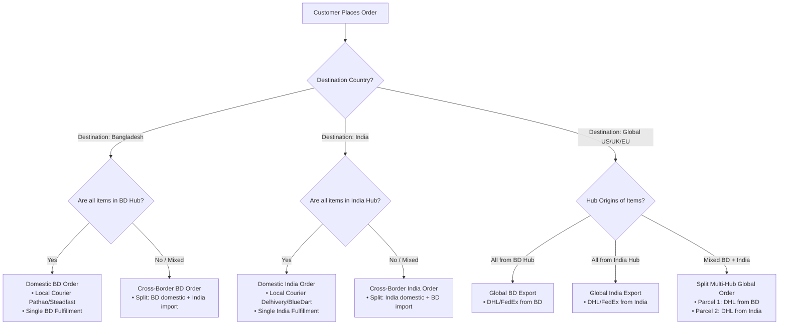

# Multi-Hub International Fashion E-Commerce: Architecture & Business Logic

## 1. Executive Summary & Brand Strategy

This architecture specifies an enterprise-ready, headless e-commerce platform for an international fashion brand operating with **two primary supply hubs (Bangladesh and India)** and serving **three distinct markets**:

1. **Bangladesh Domestic Market** (Currency: BDT ৳)
2. **India Domestic Market** (Currency: INR ₹)
3. **Global International Market** (Currency: USD $, covering US, UK, EU, UAE, etc.)

### Core Business Pillars
* **Symmetric Dual Sourcing**: Independent regional agents source local specialty garments (e.g., Jamdani/Muslin and denim knitwear in Bangladesh; Silk sarees, Chanderi, and artisanal apparel in India).
* **Per-Product Channel Isolation**: Merchandisers select precisely which channels (1 to $N$) a product is visible in. Excluded channels completely hide the product from both search and APIs.
* **Autonomous Regional Fulfillment**: Regional agents operate independently in their home territories with dedicated stock locations and scoped admin permissions.
* **Cross-Border "Global" Treatment**: When an Indian customer purchases a Bangladesh-sourced garment, the transaction is treated as an international export from the Bangladesh hub (and vice versa for BD customers buying Indian items).
* **Automated Split Shipments**: Mixed carts spanning multiple hubs split into separate fulfillments with independent courier tracking.

---

## 2. Channel & Merchandising Matrix

### 2.1 Channel Definition

| Property | 🇧🇩 Bangladesh Channel | 🇮🇳 India Channel | 🌍 Global Channel |
| :--- | :--- | :--- | :--- |
| **Channel Code / Token** | `bangladesh` | `india` | `global` |
| **Default Currency** | **BDT (৳)** | **INR (₹)** | **USD ($)** |
| **Primary Hub** | Bangladesh Hub | India Hub | Multi-Hub (BD + India) |
| **Target Customers** | Deliveries to Bangladesh | Deliveries to India | Rest of World + Cross-hub imports |
| **Payment Gateways** | bKash, Nagad, SSLCOMMERZ, Local Cards, COD | Razorpay, Cashfree, UPI, NetBanking | Stripe, PayPal, Apple Pay, Google Pay |
| **Domestic Couriers** | Pathao, Steadfast, RedX | Delhivery, BlueDart, Shiprocket | N/A (International only) |
| **Cross-Border Couriers**| DHL Express, FedEx, Aramex | DHL Express, FedEx, Aramex | DHL Express, FedEx, Aramex |

---

### 2.2 Product Catalog & Visibility Rules

In Vendure, the `Product` and `ProductVariant` entities implement `ChannelAware`. A product only exists in the channels explicitly assigned to it.

```
                          [ Product Catalog ]
                                   │
         ┌─────────────────────────┼─────────────────────────┐
         ▼                         ▼                         ▼
  [ Product A: Jamdani ]   [ Product B: Silk Saree ]   [ Product C: Denim Jacket ]
         │                         │                         │
  Channels Assigned:        Channels Assigned:        Channels Assigned:
  • Bangladesh (BDT ৳6,500) • India (INR ₹5,499)      • Bangladesh (BDT ৳3,200)
  • Global (USD $75.00)     • Global (USD $68.00)     • India (INR ₹2,800)
  (Excluded: India)         (Excluded: Bangladesh)    • Global (USD $45.00)
```

#### Visibility Behavior
* **Exclusive Domestic Drop**: Assigned only to `bangladesh`. Customers in India or Global cannot see, search, or query this item via the API.
* **Cross-Border Enabled Drop**: Assigned to `bangladesh` and `global`. 
  * Bangladesh customers buy in BDT under domestic rates.
  * Global customers (and Indian customers browsing the international catalog) buy in USD under international shipping.
* **Universal Drop**: Assigned to all channels (`bangladesh`, `india`, `global`), with independent prices defined for each currency.

---

## 3. Inventory & Multi-Hub Warehousing

### 3.1 Physical Stock Locations

Vendure manages physical stock using the `StockLocation` entity. Two primary locations are configured:

1. **`StockLocation: Bangladesh Hub`** (Located in Dhaka, managed by BD Agent)
2. **`StockLocation: India Hub`** (Located in Delhi/Mumbai, managed by India Agent)

### 3.2 Stock Allocation Rules per Variant

Each SKU tracks stock levels per location independently:

```
SKU: SILK-SAREE-RED-M
├── India Hub Stock: 45 units (Available for India domestic & Global export)
└── Bangladesh Hub Stock: 0 units

SKU: JAMDANI-DRESS-BLUE-S
├── Bangladesh Hub Stock: 30 units (Available for BD domestic & Global export)
└── India Hub Stock: 0 units

SKU: CORE-TEE-BLACK-L (Dual Manufactured)
├── India Hub Stock: 100 units
└── Bangladesh Hub Stock: 120 units
```

### 3.3 Stock Reservation Lifecycle
1. **Order Placed**: Stock is moved from `stockOnHand` to `stockAllocated` in the assigned hub.
2. **Order Shipped**: `stockAllocated` decreases and physical `stockOnHand` decreases.
3. **Order Cancelled / Returned**: `stockAllocated` is released back to available inventory.

---

## 4. Order Routing & Multi-Fulfillment Business Logic

### 4.1 Order Classification Flowchart



---

### 4.2 Split Fulfillment Scenario Walkthrough

**Customer Cart (Destination: New York, USA):**
* 1x *Silk Saree* (Stocked in India Hub) — $85.00
* 1x *Jamdani Tunic* (Stocked in Bangladesh Hub) — $75.00

**Checkout Processing:**
1. **Cart Total**: $160.00 + Multi-Hub International Shipping ($25 India + $25 BD = $50). Total: $210.00.
2. **Order Creation**: Single `Order` record with status `PaymentSettled`.
3. **Fulfillment Generation**:
   * **`Fulfillment #1 (India Hub)`**:
     * Line item: *Silk Saree*
     * Assigned Agent: India Regional Agent
     * Action: India agent packs item, schedules pickup with Indian DHL Express, inputs tracking number `DHL-IN-987654`.
     * Notification: Customer receives "Your item from our India Studio has shipped!"
   * **`Fulfillment #2 (Bangladesh Hub)`**:
     * Line item: *Jamdani Tunic*
     * Assigned Agent: Bangladesh Regional Agent
     * Action: BD agent packs item, schedules pickup with BD DHL Express, inputs tracking number `DHL-BD-123456`.
     * Notification: Customer receives "Your item from our Bangladesh Studio has shipped!"
4. **Order Completion**: Once both fulfillments reach `Delivered`, the parent `Order` transitions to `Delivered`.

---

## 5. Customs, Regulatory & Cross-Border Compliance

### 5.1 Indian Customs Import Requirements (BD $\to$ India)
* **Mandatory KYC for Imports**: Indian Customs requires official identification (Aadhaar number, PAN card, or Passport) for all international incoming parcels.
* **Storefront UX Requirement**: If an Indian delivery address is selected for an order containing Bangladesh Hub items:
  * Display a dedicated KYC form field: *"Indian Customs requires Recipient Government ID (Aadhaar / PAN / Passport) for cross-border clearance."*
  * Store this value in `Order.customFields.recipientKycId` for invoice generation.

### 5.2 Apparel Harmonized System (HS) Codes & Commercial Invoices
Every cross-border package must automatically generate a Commercial Export Invoice with standard garment HS codes:
* **Silk Garments**: HS Code `6204.49` / `6206.10`
* **Cotton / Muslin Garments**: HS Code `6204.42` / `6206.30`
* **Export Declaration**: Automated export packing slip generated in Vendure Admin attaching seller GSTIN (India) or BIN/TIN (Bangladesh).

---

## 6. Backend Implementation Specification (Vendure 3.x)

### 6.1 Custom Field Extensions & Database Schema

Configured in `apps/server/src/vendure-config.ts` and managed by `@suisuto/vendure-multi-hub-plugin`:

```typescript
customFields: {
  Product: [
    {
      name: 'originHub',
      type: 'string',
      public: true,
      nullable: true,
      description: 'Physical artisan supply hub (BD_HUB, IN_HUB, DUAL_HUB)',
    },
    {
      name: 'fabricCareGuide',
      type: 'text',
      public: true,
      nullable: true,
    },
    {
      name: 'modelSpecs',
      type: 'string',
      public: true,
      nullable: true,
      description: 'e.g. Model is 5\'9" wearing size S',
    },
    {
      name: 'hsCode',
      type: 'string',
      public: false,
      nullable: true,
      description: 'Apparel HS Code for Customs Export',
    },
  ],
  Order: [
    {
      name: 'recipientKycId',
      type: 'string',
      public: true,
      nullable: true,
      description: 'Aadhaar / PAN / Passport for Indian Customs imports',
    },
    {
      name: 'isMultiHubOrder',
      type: 'boolean',
      public: true,
      defaultValue: false,
    },
  ],
  StockLocation: [
    {
      name: 'hubCode',
      type: 'string',
      public: true,
      nullable: true,
      description: 'Hub code identifier (e.g. BD_HUB, IN_HUB, DUAL_HUB)',
    },
    {
      name: 'countryCode',
      type: 'string',
      public: true,
      nullable: true,
      description: '2-letter ISO country code (e.g. BD, IN)',
    },
    {
      name: 'domesticCarrier',
      type: 'string',
      public: true,
      nullable: true,
      description: 'Domestic courier (e.g. Pathao, Delhivery)',
    },
    {
      name: 'crossBorderCarrier',
      type: 'string',
      public: true,
      nullable: true,
      description: 'Cross-border courier (e.g. DHL Express)',
    },
    {
      name: 'standardTransitDays',
      type: 'int',
      public: true,
      nullable: true,
      defaultValue: 3,
      description: 'Standard delivery timeframe in days',
    },
  ],
};
```

#### Database Migrations
Applied via TypeORM migrations in `apps/server/src/migrations/`:
- `1790100000003-add_stock_location_custom_fields.ts`: Adds `customFieldsHubcode`, `customFieldsCountrycode`, `customFieldsDomesticcarrier`, `customFieldsCrossbordercarrier`, `customFieldsStandardtransitdays` columns to the `stock_location` table.
- `1790140748431-sync_schema.ts`: Schema synchronization and index alignment across custom entities.

---

### 6.2 Administrator Roles & Scoped Permissions

1. **SuperAdmin (Owner / Executive Team)**:
   * Channels: `[Default, Bangladesh, India, Global]`
   * Permissions: `SuperAdmin` (Full access to all analytics, products, payouts, settings).

2. **India Regional Agent**:
   * Channels: `[India, Global]`
   * Permissions:
     * `ReadCatalog`, `UpdateCatalog` (for assigned products)
     * `ReadOrder`, `UpdateOrder` (only orders containing India Hub items)
     * `CreateFulfillment`, `UpdateFulfillment` (India shipments)
     * `ReadStockLocation`, `UpdateStockLocation` (restricted to `India Hub`)

3. **Bangladesh Regional Agent**:
   * Channels: `[Bangladesh, Global]`
   * Permissions:
     * Scoped identically to the India agent, restricted to `Bangladesh Hub` and BD orders.

---

### 6.3 Domain Plugin Package: `@suisuto/vendure-multi-hub-plugin`

Implemented as a modular domain package located in [`apps/packages/multi-hub`](file:///c:/laragon/www/vendure/apps/packages/multi-hub):

```
apps/packages/multi-hub/
├── constants/          # Hub definitions, carrier presets, action constants
├── dashboard/          # Vendure Admin Dashboard extension
├── resolvers/          # Admin GraphQL queries and mutations
├── services/           # Fulfillment splitting and stock query services
├── shipping/           # Dynamic split-shipping calculator & eligibility checker
├── strategies/         # MultiHubStockLocationStrategy
├── tests/              # Jest unit test suite (17 tests)
├── types/              # Hub metadata and GraphQL typings
├── multi-hub.plugin.ts # Plugin bootstrap & UI extension registration
├── package.json
└── README.md           # Documentation & SOPs
```

* **`MultiHubStockLocationStrategy`** ([`strategies/multi-hub-stock-location.strategy.ts`](file:///c:/laragon/www/vendure/apps/packages/multi-hub/strategies/multi-hub-stock-location.strategy.ts)): Directs line allocation to physical warehouses matching `StockLocation.customFields.hubCode`, falling back to location name matching and regional prefix parsing.
* **`multiHubShippingEligibilityChecker`** ([`shipping/multi-hub-shipping.ts`](file:///c:/laragon/www/vendure/apps/packages/multi-hub/shipping/multi-hub-shipping.ts)): Validates destination country matching (`BD`, `IN`, or `ALL`).
* **`multiHubShippingCalculator`** ([`shipping/multi-hub-shipping.ts`](file:///c:/laragon/www/vendure/apps/packages/multi-hub/shipping/multi-hub-shipping.ts)): Computes single domestic flat rate or per-origin-hub international surcharges when items span multiple supply hubs.
* **`MultiHubFulfillmentService`** ([`services/multi-hub-fulfillment.service.ts`](file:///c:/laragon/www/vendure/apps/packages/multi-hub/services/multi-hub-fulfillment.service.ts)): Automatically splits multi-hub customer orders into separate Vendure `Fulfillment` entities grouped by `originHub`, assigning discrete carrier dispatches and tracking codes.
* **Admin Operations Dashboard** ([`dashboard/`](file:///c:/laragon/www/vendure/apps/packages/multi-hub/dashboard)): UI extension registered under **Settings -> Fulfillment Hubs** (`/admin/settings/multi-hub`) featuring live KPI cards, physical warehouse management, catalog `originHub` reassignment, split-shipping simulator, and split-order auditor.
* **Automated Unit Tests** ([`tests/multi-hub.spec.ts`](file:///c:/laragon/www/vendure/apps/packages/multi-hub/tests/multi-hub.spec.ts)): Dedicated test suite (17 passing unit tests) validating stock allocation, eligibility checks, shipping rates, and fulfillment grouping (run via `pnpm run test:multi-hub`).

---

## 7. Frontend Storefront Architecture (TanStack Start)

### 7.1 Channel Context & Dynamic Token Injection

In `apps/storefront`, every GraphQL request passes the active channel token in HTTP headers via `api.server.ts`:

```typescript
// apps/storefront/src/platform/vendure/api.server.ts
export function getChannelToken(market: 'BD' | 'IN' | 'GLOBAL'): string {
  switch (market) {
    case 'BD':
      return process.env.VENDURE_CHANNEL_TOKEN_BD || 'bangladesh';
    case 'IN':
      return process.env.VENDURE_CHANNEL_TOKEN_IN || 'india';
    case 'GLOBAL':
    default:
      return process.env.VENDURE_CHANNEL_TOKEN_GLOBAL || 'global';
  }
}
```

### 7.2 Geo-Location Detection & Currency Switcher

```
┌────────────────────────────────────────────────────────┐
│  [Logo]   Shop Women  Men  Lookbook    [ 🇮🇳 India (₹) ▼ ]│
└────────────────────────────────────────────────────────┘
                                               │
                                 ┌─────────────┴─────────────┐
                                 │ 🇧🇩 Bangladesh (BDT ৳)      │
                                 │ 🇮🇳 India (INR ₹)          │
                                 │ 🌍 Global (USD $)         │
                                 └───────────────────────────┘
```

1. **First Visit**: Reads IP address headers (`x-forwarded-for` / Cloudflare `CF-IPCountry` / `x-ip-country`).
   * IP in BD $\to$ defaults to `Bangladesh Channel` (BDT ৳).
   * IP in India $\to$ defaults to `India Channel` (INR ₹).
   * Rest of World $\to$ defaults to `Global Channel` (USD $).
2. **Manual Override**: Customer can toggle country in the navigation bar anytime. Choice persists in cookies (`vendure-region`).

### 7.3 Visual Badges & Trust Elements

* **Domestic Item**:
  * Badge: `⚡ Domestic Express (2-3 Days)`
  * Note: `Dispatched locally from our Mumbai/Dhaka hub`
* **Imported / Cross-Border Item**:
  * Badge: `✈️ International Studio Drop (5-8 Days)`
  * Note: `Crafted and shipped directly from our Bangladesh/India atelier`
  * Cart Note: `Includes international courier delivery`

---

## 8. Financial & Payment Gateway Topology

```
                  ┌─────────────────────────────────────┐
                  │           CHECKOUT ROUTER           │
                  └──────────────────┬──────────────────┘
                                     │
           ┌─────────────────────────┼─────────────────────────┐
           ▼                         ▼                         ▼
   [BD Domestic]              [India Domestic]             [Global]
   • Gateway: SSLCOMMERZ      • Gateway: Razorpay          • Gateway: Stripe
   • Methods:                 • Methods:                   • Methods:
     - bKash Direct Checkout    - UPI (GPay, PhonePe, Paytm) - Credit/Debit Cards
     - Nagad                    - Indian NetBanking          - Apple Pay / Google Pay
     - Local Credit/Debit Cards - Domestic Credit Cards      - PayPal
     - Cash on Delivery (COD)   - COD (optional)
```

---

## 9. Standard Operating Procedures (SOPs)

### 9.1 Merchandising: Adding a New Garment
1. Open **Vendure Admin** $\to$ **Catalog** $\to$ **Products** $\to$ **Create Product**.
2. Enter Title (e.g., *"Hand-Embroidered Chanderi Kurta"*), Description, and upload high-res photography.
3. In the **Channels** widget:
   * Select `India` and `Global`.
   * Leave `Bangladesh` unchecked if not retailing domestically in BD.
4. Set Channel Prices:
   * India Channel view: `₹4,200`
   * Global Channel view: `$62.00`
5. Set Stock Levels:
   * `India Hub`: 35 units
   * `Bangladesh Hub`: 0 units
6. Save & Publish. The item immediately goes live on the India and Global storefronts, remaining invisible in Bangladesh.

### 9.2 Fulfillment: Processing a Daily Drop
1. **India Agent** logs into Vendure Admin (restricted to India scope):
   * Filters orders by `Fulfillment Status: Pending`.
   * Prints domestic shipping labels (Delhivery) for domestic orders.
   * Prints commercial invoices and international airway bills (DHL) for export orders.
   * Clicks **Fulfill** and inputs tracking numbers.
2. **Bangladesh Agent** executes identical SOP for Bangladesh domestic (Pathao/Steadfast) and BD export orders.
3. System automatically triggers email notifications to customers with localized tracking links.
